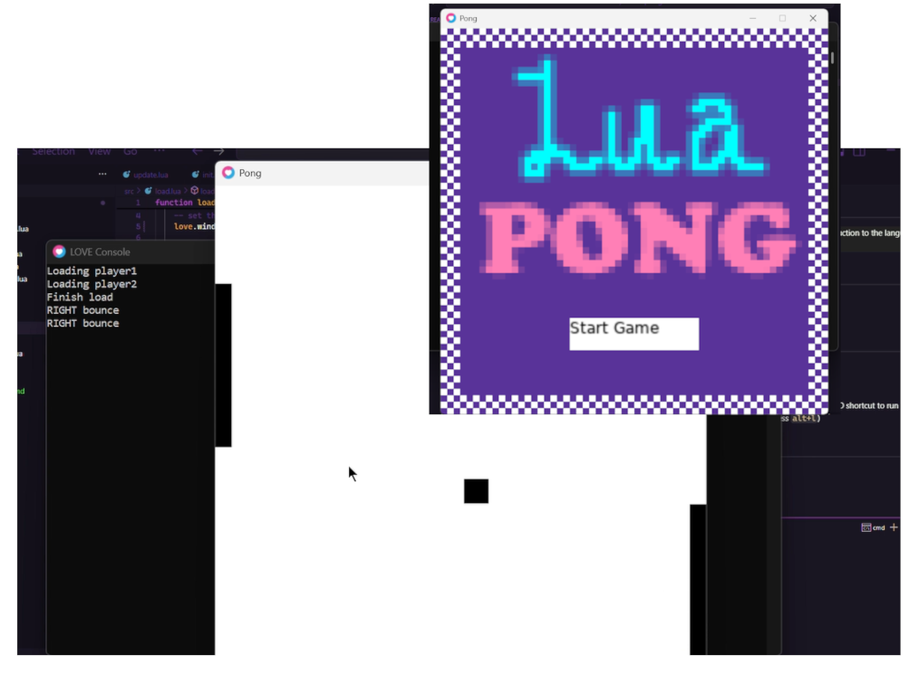

# Pong - Made with Lua x Love2D

> A simple Pong game made with Lua x Love2D to teach myself an introduction to the language and game engine. 👾

## In This Repo
* [/src](/src/) - All the code for game logic
* [main.lua](main.lua) - Lua entry point

## How to Run
* Clone this Repo
* Install >= [Lua 5.4.8](https://www.lua.org/download.html)
* Install >= [Love2D 11.5](https://love2d.org/)
* Drop this repo folder containing the `main.lua` file over your Love2D shortcut to run (or alternatively use VSCode Love2D extension and press `alt+l`)

## Feature Implementation Plan
- [x] Basic 2-player pong
- [ ] More flexible collision detection
- [ ] Reset game ability
- [ ] Create & use animated graphics
- [ ] Add in sound effects
- [ ] Scoring system
- [ ] Save files for scores
- [x] "Landing" screen to start the game
- [ ] Difficulty increase
- [ ] Individual player buffs
- [ ] Up to 4 player support
- [ ] Create .love file for game distribution

## Resources I've found useful

**🎥 Youtube Videos:**
* [Love2D Quick Install and Setup Guide](https://www.youtube.com/watch?v=kpxkQldiNPU) - Challacade
* [How to (easily) add Animations to a Character](https://www.youtube.com/watch?v=ON7fpPIVtg8) - Challacade
* [Love2D: Make Your Games Look Great on all Screen Sizes](https://www.youtube.com/watch?v=tjWdGLJFpXU) - Gabe Stein

**📃 Docs:**
* [Object-Oriented Programming in Lua](https://www.lua.org/pil/16.html)
* [Love2D Game Distribution](https://love2d.org/wiki/Game_Distribution)